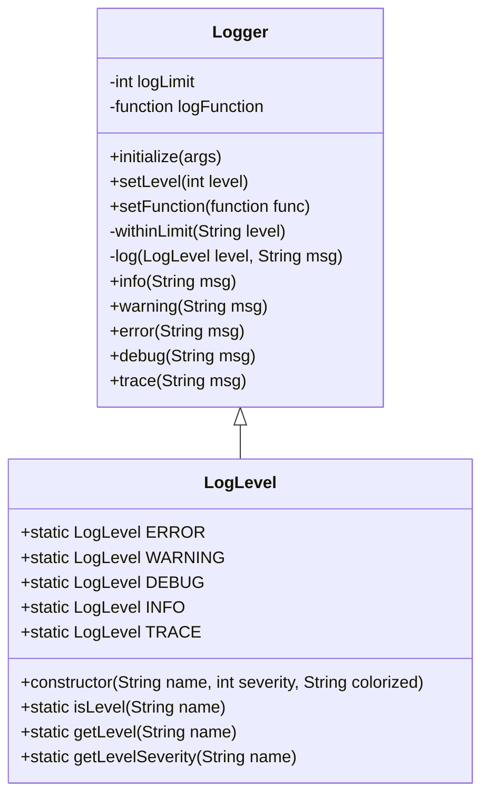

# Logger
This details the implementation of the logger module within the context of the web portfolio. Architectural design, Design decisions, and Interface design are discussed within.

## Introduction
The logger is a singleton module that handles console output and logging in the web portfolio. It allows for the following features:
 - Fine-grained control of logging, and configuration of which logs are displayed.
 - Detailled log information that make location and time discovery of errors easy.
 - Easy to use logging interface.

# High-level design

## Design Motivations
The design for the logger is guided by multiple principles. Each one helps to create a logging interface that is as simple as possible, while still robust and informative

#### Control of output:
Being able to control the logger to show different levels of output allows for the ability to both debug errors, and monitor high-level issues. This supports both deployment, and development environments with minimal configuration. This leaves the responsibility to the developer to use the correct log message levels when logging however.

#### Simple interface:
The logger must be simple enough to use easily, or else it will not be used at all. Console log messages will be favored. Adding complexity to the logger may add utility, but too much complexity puts too much emphasis on logging correctly, where the actual emphasis is on development. 

#### Readability:
Highly readable logs make it easier to pinpoint errors that can occur infrequently. Logging to files also helps to archive logs and search through them to debug an issue that cannot be reproduced.

## Architectural Design
The logger is a singleton class that exposes logging functions for use throughout the portfolio. It is easy to import and requires minimal configuration to start up. The Logger class uses Logging Levels to manager whether or not a log should be sent based on the loggers configuration. 

Due to being a singleton, any class can import the Logger and use it immediately. It is required to configure the logger once at the program start though. The logger initializes itself and exports a single copy for use by the rest of the portfolio. 

#### Log Severity:
The Logger class makes use of Log Levels. Each log level has a corresponding severity. Severity is ordered from lowest to highest. This means the highest severity log level corresponds to a level of 1. The lowest corresponds to 5. The list of all log levels is shown in the table below:

| Name | Severity | Purpose | 
| --- | --- | --- |
| ERROR | 1 | Reporting malfunctions in the portfolio |
| WARNING | 2 | Potential problems in the portfolio that are not errors |
| INFO | 3 | Standard events within the portfolio |
| DEBUG | 4 | Potentially useful messages to diagnose errors in the portfolio |
| TRACE | 5 | Messages that typically create 'log spam' but are still useful to track |

#### Log Function:
The logger also is configurable to use different log functions. The standard log function prints to the console, but by passing in your own function, you can change this. This gives the developer the ability to configure the logger to do exactly what they want. The log format that is sent cannot be changed though. Adding configuration of the log format could be a future feature.

# Low-level Design

## Concrete Implementation
This is a class diagram of the current implementation of the logger:



#### Logger
The implementation of the logger is simple. After initializing the logger, log calls can start to be made. By default, the log function simply prints to console, but you can configure it to log to file, or whatever you can fit inside of the log function. It may be worthwhile in the future to dedicate a class to the logging function. This could allow for features such as logging over a TCP socket.
Here's an example of making a log function that wites to a file rather than the console.

```javascript
logger.setFunction( (msg) -> {
  fs.writeFileSync('portfolio.log', msg)
})
```

#### LogLevel
The LogLevel class functions as an enum of log levels for the Logger. It has several utility functions for managing LogLevels as well. I referenced https://www.sohamkamani.com/javascript/enums/ to create a pseudo-enum in Javascript, since the functionality isn't there.

There is a LogLevel class for each severity mentioned above. And each LogLevel has the following attributes: Name, Severity, and Colorized.

##### Colorized
The name for this probably isn't very clear, and I will probably refactor it to make more sense in the future. In essence, it is colorized string version of the enum name. This makes it very easy to differentiate enums in while watching logs in the terminal.

Color is handled by using the npm package `chalk`. I'm currently using version 4, due to the fact that version 5 requires the use of modules, which my portfolio has not adapted to yet. The color for each log level is the following:

| Name | Severity | Color | 
| --- | --- | --- |
| ERROR | 1 | Red |
| WARNING | 2 | Yellow |
| INFO | 3 | Blue |
| DEBUG | 4 | Magenta |
| TRACE | 5 | Gray |


